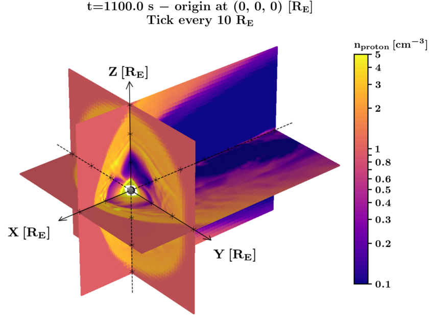

# 3D_VQ-VAE_pytorch

An example implementation of a three-dimensional (3D) Vector-Quantized Variational Autoencoder (VQ-VAE) prototype, here used for the compression task of 3D data cubes. This 3D VQ-VAE is an extension of the 2D version developed by [airalcorn2](https://github.com/airalcorn2/vqvae-pytorch/tree/master). The model comprises of ResNet Encoder and Decoder modules, as well as the Vector Quantization module at the bottleneck. The main motivation for using a VQ-VAE for this compression task is that the vector quantization should produce efficient compressions due to the sparsity in these data. The example 3D data cube used here is a 3D Velocity Distribution Function (VDF) simulated by Vlasiator.

Vlasiator [@palmroth2018](https://pubmed.ncbi.nlm.nih.gov/30680308/) is an open-source simulation software used to model the behavior of plasma in the Earth's magnetosphere, a region of space where the solar wind interacts with the Earth’s magnetic field. Vlasiator models collisionless space plasma dynamics by solving the 6-dimensional Vlasov equation, using a hybrid-Vlasov approach. It uses a 3D Cartesian grid in real space, with each cell storing another 3D Cartesian grid in velocity space. The 3D VDF cube we use as an example here is the representation of a single cell in the velocity space. Here's an example of the magnetospheric simulation produced by Vlasiator (credits to Markku Alho and Kostis Papadakis for the following visualization).

